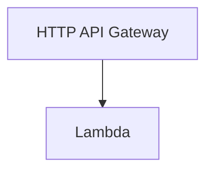

# Lambda

Deploys Lambda Function with API Gateway.

# Terraform Resources

| Resource | Terraform |
| -------- | --------- |
| aws_iam_role | https://registry.terraform.io/providers/hashicorp/aws/latest/docs/resources/iam_role |
| aws_cloudwatch_log_group | https://registry.terraform.io/providers/hashicorp/aws/latest/docs/resources/cloudwatch_log_group |
| lambda_function | https://registry.terraform.io/providers/hashicorp/aws/latest/docs/resources/lambda_function |
| lambda_permission | https://registry.terraform.io/providers/hashicorp/aws/latest/docs/resources/lambda_permission |
| apigatewayv2_api | https://registry.terraform.io/providers/hashicorp/aws/latest/docs/resources/apigatewayv2_api |
| apigatewayv2_stage | https://registry.terraform.io/providers/hashicorp/aws/latest/docs/resources/apigatewayv2_stage |
| apigatewayv2_route | https://registry.terraform.io/providers/hashicorp/aws/latest/docs/resources/apigatewayv2_route |
| apigatewayv2_integration | https://registry.terraform.io/providers/hashicorp/aws/latest/docs/resources/apigatewayv2_integration |